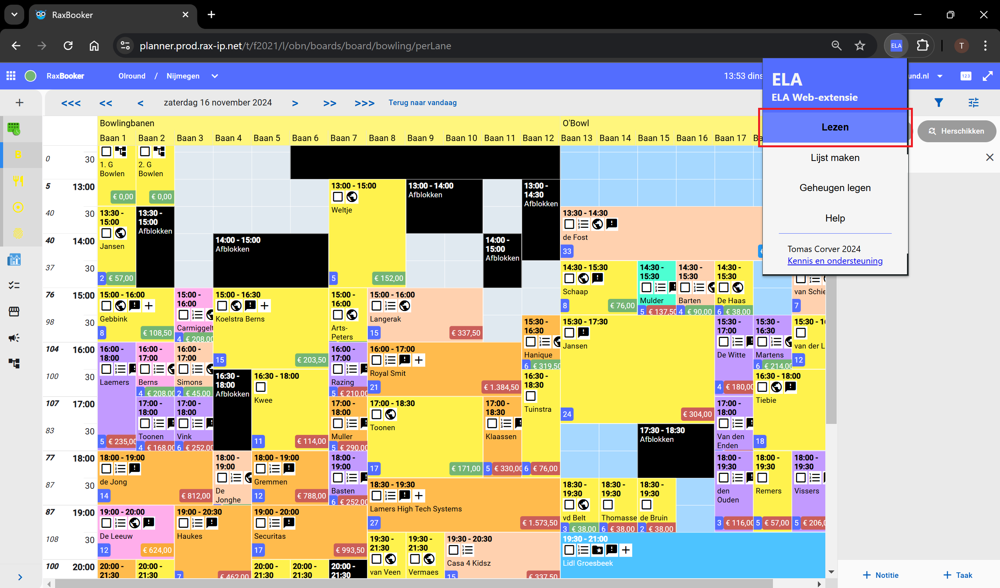

Gebruikershandleiding voor ELA Web-extensie

## Snelle navigatie
- [Stap-voor-stap uitleg](#uitleg)
- [Probleemoplossingen](#problemen)
- [Problemen melden](#foutrapporten)

## Uitleg
1. Druk op deze knop voor de ELA-popup.

2. Zorg ervoor dat je altijd het geheugen leegt voordat je met een nieuwe lijst begint.

3. Klik op "**Lezen**". Wacht 3-5 seconden (beweeg de muis niet!). Dit proces is klaar wanneer het detailscherm een andere reservering laat zien.

4. Herhaal stap 3 voor iedere locatie (banen, restaurant, obowlrestaurant, pi).

5. Open de ELA-popup en klik op "Lijst maken".

6. Als het bestand is gedownload ben je klaar. Je opent deze **niet** door er op te klikken!

## Problemen
Hier staan per stap van de [uitleg](#uitleg) verschillende problemen beschreven die kunnen voorkomen, met daarbij een mogelijke oplossing.
### Stap 1
Als de knop er niet staat, kan het zijn dat de ELA Web-extensie niet goed is geïnstalleerd. Om een ELA-service te installeren ga je naar de [kennisbasis](README.md#downloads)
### Stap 3
Als er na 10 seconden niets gebeurd, kan het zijn dat de extensie en de pagina niet met elkaar gesynchroniseerd zijn. Dit is op te lossen door de pagina te verversen (<kbd>F5</kbd> of <kbd>Ctrl</kbd> + <kbd>R</kbd>).
